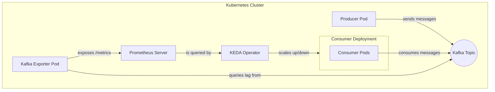

# Scaling Kubernetes Pods with Custom Metrics (Kafka Lag)

This project is a hands-on demonstration of how to implement a custom, metrics-driven autoscaling system in Kubernetes. While the default Horizontal Pod Autoscaler (HPA) excels at scaling based on CPU and Memory, this project tackles a more advanced, real-world scenario: **scaling a service based on the consumer lag of an Apache Kafka topic.**

This repository is the companion to our detailed blog post. It provides all the necessary code and configuration to build and test the entire system from scratch.

The `master` branch, which you are currently viewing, implements the scaling logic using the **Prometheus Kafka Exporter** to generate the necessary lag metrics externally.

## Architecture (`master` branch)

The architecture is designed to be robust and decoupled. The key components are:

1.  **Kafka Producer/Consumer:** Spring Boot applications that simulate a real-world messaging workload.
2.  **Kafka Exporter:** A standalone service that connects to Kafka, queries for consumer group lag, and exposes it as a Prometheus metric.
3.  **Prometheus:** A monitoring server that scrapes the metrics from the Kafka Exporter.
4.  **KEDA:** The autoscaler that queries Prometheus and scales the consumer `Deployment` based on the lag.



## Prerequisites

Before you begin, ensure you have the following tools installed and configured on your machine:

*   **Minikube:** `v1.36.0` or similar
*   **Kubernetes CLI (kubectl):** `v1.32.2` or similar
*   **Helm:** `v3.18.3` or similar
*   **Docker:** (To be used as the Minikube driver and for building images)
*   **Java 17+ & Maven:** (For building the Spring Boot applications)

## Getting Started: Step-by-Step Guide

Follow these steps to get the entire environment up and running.

### 1. Clone the Repository

```sh
git clone https://github.com/milkeryildirim/scaling-k8s-pods-using-custom-metrics.git
cd scaling-k8s-pods-using-custom-metrics
```

### 2. Start the Kubernetes Cluster

We will use Minikube to create a local Kubernetes cluster.

```sh
minikube start --kubernetes-version=v1.33.1 --memory 4096 --cpus 2 --driver=docker
```

### 3. Deploy Kafka

We'll use Helm to deploy a SASL-enabled Kafka cluster.

```sh
# Create a namespace for Kafka
kubectl create namespace kafka

# Install Kafka using the Bitnami chart
helm upgrade kafka bitnami/kafka --version 32.3.1 --namespace kafka --set sasl.client.users[0]=user1 --set sasl.client.passwords[0]=password1 --install --create-namespace
```

### 4. Create the Multi-Partition Kafka Topic

For scaling to work, our topic needs multiple partitions.

```sh
# Start a temporary client pod
kubectl run kafka-client -n kafka --rm -it --image=docker.io/bitnami/kafka:3.7 --command -- /bin/bash

# Inside the pod's shell, create a properties file for authentication
cat <<EOF > /tmp/client.properties
security.protocol=SASL_PLAINTEXT
sasl.mechanism=PLAIN
sasl.jaas.config=org.apache.kafka.common.security.plain.PlainLoginModule required \
  username="user1" \
  password="password1";
EOF

# Now, create the topic with 3 partitions
kafka-topics.sh \
  --bootstrap-server kafka.kafka.svc.cluster.local:9092 \
  --command-config /tmp/client.properties \
  --create \
  --topic messages.topic \
  --partitions 3 \
  --replication-factor 1

# Exit the pod's shell
exit
```

### 5. Deploy the Kafka Exporter

This service will expose the lag metrics. We use the `values.yaml` file located in the `kafka-exporter` directory.

```sh
helm upgrade kafka-exporter prometheus-community/prometheus-kafka-exporter \
  --version 2.12.1 \
  --namespace kafka \
  --install \
  --create-namespace \
  --values kafka-exporter/kafka-exporter-values.yaml
```

### 6. Deploy Prometheus

This will scrape the metrics from the exporter.

```sh
kubectl create namespace monitoring
helm install prometheus prometheus-community/prometheus --namespace monitoring
```

### 7. Build and Deploy The Applications

First, point your terminal's Docker client to Minikube's Docker daemon:

```sh
eval $(minikube -p minikube docker-env)
```

Now, build the Docker images for our producer and consumer applications.

```sh
# Build the producer image
docker build -t kafka-producer:1.0 -f kafka-producer/Dockerfile .

# Build the consumer image
docker build -t kafka-consumer:1.0 -f kafka-consumer/Dockerfile .
```

Finally, deploy them to Kubernetes.

```sh
kubectl apply -f kafka-producer/k8s/
kubectl apply -f kafka-consumer/k8s/
```

### 8. Deploy KEDA and the Scaler

Install KEDA, which will act on the metrics.

```sh
kubectl create namespace keda
helm install keda kedacore/keda --namespace keda
```

Now, apply our `ScaledObject` which contains the scaling rules.

```sh
kubectl apply -f kafka-consumer/k8s/keda-scaler.yaml
```

## Testing the Autoscaling

Your system is now fully configured! To see it in action:

1.  **In one terminal, watch the pods:**
    ```sh
    # You should see 1 consumer pod running
    kubectl get pods -w
    ```

2.  **In a second terminal, generate a heavy load:**
    ```sh
    # This sends 100 messages to the producer to generate lag
    for i in {1..100}; do
      curl -s -X POST -H "Content-Type: text/plain" --data "Scaling test message $i" $(minikube service kafka-producer-service --url)/api/v1/messages > /dev/null
      echo "Sent message $i"
    done
    ```

3.  **Observe!** Switch back to your first terminal. Within a minute, you will see new `kafka-consumer` pods being created to handle the load. Once the lag is cleared, KEDA will automatically scale the deployment back down to one pod.

## Branching Strategy

This repository contains two different approaches to generating the necessary metrics.

*   **`master` (this branch):** Uses the **Prometheus Kafka Exporter**, an external tool, to monitor lag. This is a non-intrusive, code-free approach to metric generation.
*   **`custom-metric-exporter`:** Uses a **custom Java library** embedded in the consumer application to generate the metrics from within. This gives more control but requires application-level changes.
    *   **Link:** [https://github.com/milkeryildirim/scaling-k8s-pods-using-custom-metrics/tree/custom-metric-exporter](https://github.com/milkeryildirim/scaling-k8s-pods-using-custom-metrics/tree/custom-metric-exporter)